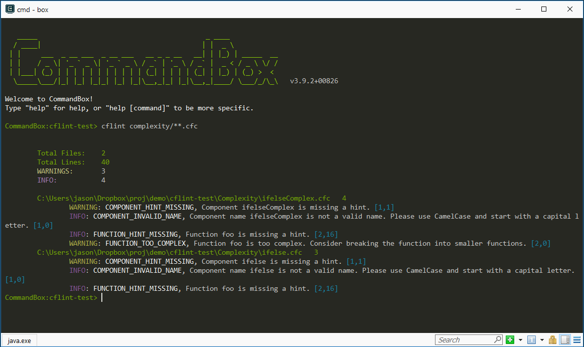
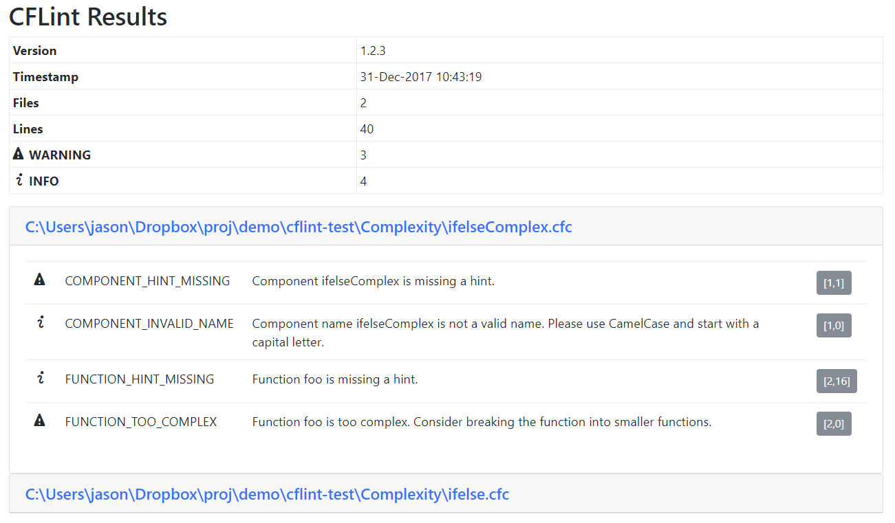

# commandbox-cflint

This is a [CommandBox](https://www.ortussolutions.com/products/commandbox) module for linting your CFML code using [CFLint](https://github.com/cflint/CFLint).

CFLint Version: 1.2.3

## Install

First you will need [CommandBox](https://www.ortussolutions.com/products/commandbox) installed. Then you can install the commandbox-cflint module using the following command.

```
box install commandbox-cflint
```

## Usage

It Can be run on a single file or aginst a list of files defined by a file globbing pattern

```
box cflint **.cfc|**.cfm
```

Run for all components in the models directory.

```
box cflint models/**.cfc
```

Generate html report instead of console output.

```
box cflint models/**.cfc --html
```

## Example Output

#### Example Console Output



#### Example HTML Report


